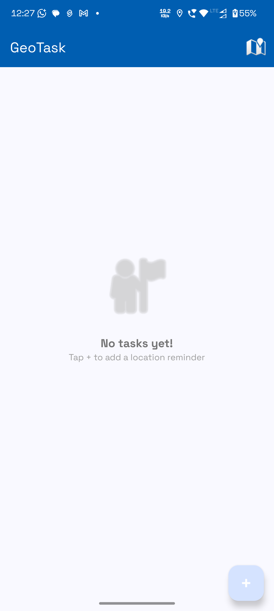
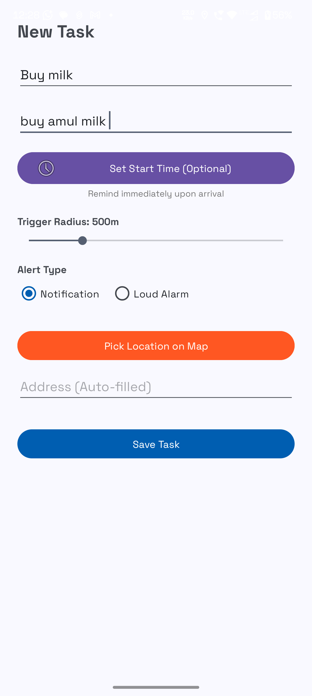
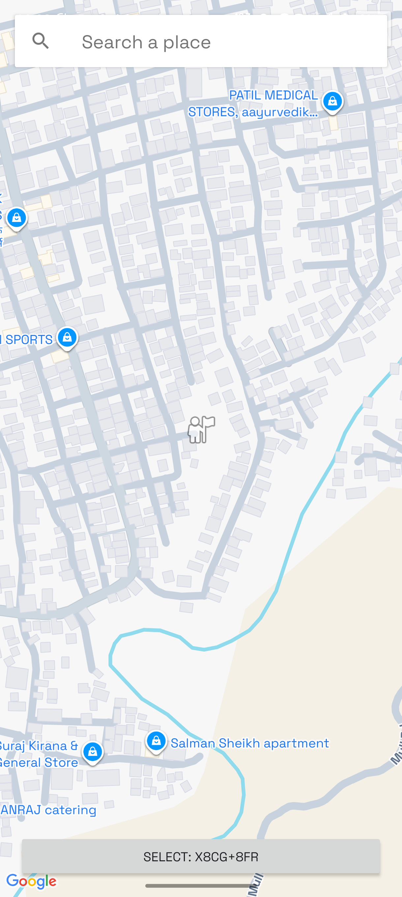
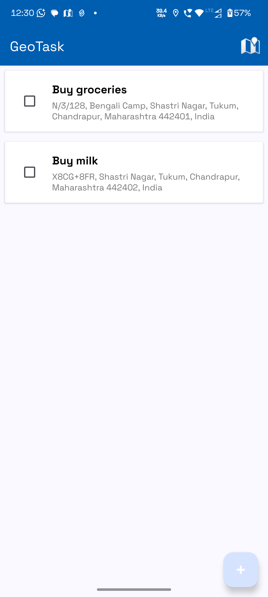
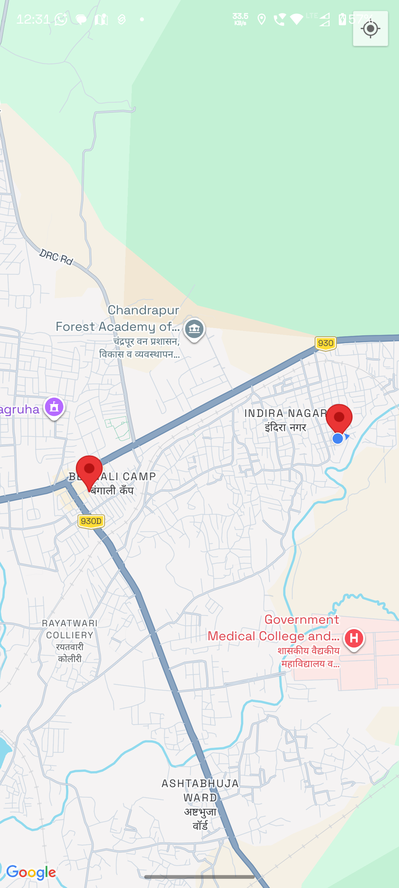

# GeoTasks – Location Based Task Reminder Android App

GeoTasks is a location-based task reminder Android application that notifies users when they reach a specific location. The app uses GPS, Google Maps API, and a background geofence service to monitor the user’s location and trigger alerts when entering a defined radius.

## Features
- Location-based task reminders
- Google Maps location picker
- Adjustable trigger radius
- Background geofence service
- Notification and alarm alerts
- Mark task as completed from notification
- Task visualization on map
- Local SQLite database

## Technologies Used
- Java (Android)
- Google Maps API
- Location Services (FusedLocationProvider)
- SQLite Database
- Foreground Service
- Notifications

## How It Works
The app continuously monitors the user’s location using a foreground service. When the user enters the radius of a saved task location, the app triggers a notification or alarm reminding the user to complete the task.

## Screenshots

### Home Screen

### Add Task

### Pick Location

### Task List

### Tasks on Map

### Notification Trigger

## Author
Bharat Sarkar
